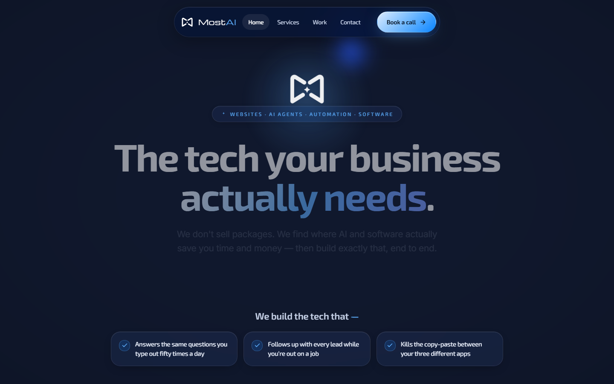

# MostAI

AI product studio building agents, automations, websites, and custom software for real businesses.



## The studio

MostAI helps businesses turn operational problems and product ideas into working software. The site presents the studio through clear service paths, selected work, an interactive visual system, and a direct consultation flow.

## Services

- **AI agents** — task-focused systems with explicit tools, boundaries, and human control
- **Automation** — reliable workflows that connect existing business systems
- **Websites** — high-quality, responsive marketing and product experiences
- **Custom software** — focused internal tools and full-stack business products

## Build process

1. Define the business outcome, user, constraints, and success criteria.
2. Map the workflow and decide where AI is useful—and where deterministic software is safer.
3. Build a working vertical slice early, then refine through real feedback.
4. Test behavior, failure states, accessibility, performance, and deployment configuration.
5. Ship with clear ownership, documentation, and approval gates for sensitive actions.

## Website experience

The marketing site uses a custom visual system with responsive layouts, motion, interactive service previews, and a lightweight WebGL background. It remains a static deployment: no framework runtime or build pipeline is required.

## Stack

- Semantic HTML
- Token-driven CSS
- Vanilla JavaScript
- Three.js, GSAP, ScrollTrigger, and Lenis for progressive visual enhancement
- Web3Forms for contact delivery
- Vercel-compatible static hosting

## Contact form

`contact.html` contains the live Web3Forms implementation and `site.js` submits it asynchronously with success and error states. Web3Forms access keys are frontend identifiers by design; the production key should be restricted to the final MostAI domain in the Web3Forms dashboard and rotated if it has ever been used outside that domain.

## Local preview

No build step is required.

```bash
python -m http.server 8000
```

Open `http://localhost:8000` and test the home, service, work, contact, and privacy pages.

## Deployment

Import the repository into Vercel as a static site:

- Framework preset: `Other`
- Build command: none
- Output directory: repository root
- Production entry point: `index.html`

The final custom domain should also be applied to the site metadata and the Web3Forms domain restriction.

## Repository note

This is the MostAI studio website and a founder portfolio project. No open-source license is granted by this repository.
